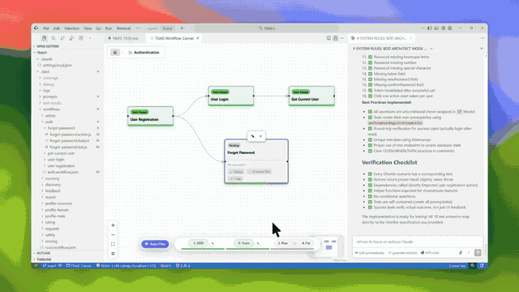
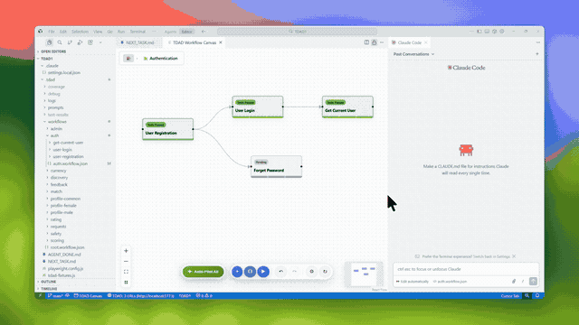
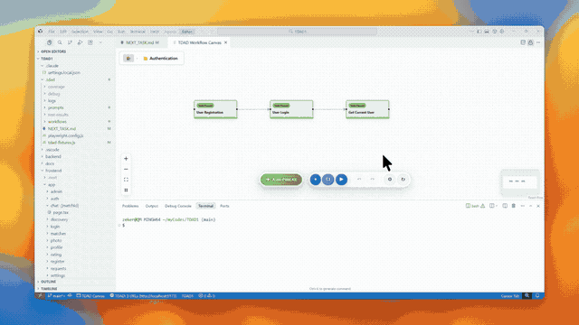

# TDAD: Test-Driven AI Development

<!-- Badges will be added here after marketplace publication -->
[](https://opensource.org/licenses/MIT)
[](CONTRIBUTING.md)

**TDAD** (Test-Driven AI Development) is a **visual workflow engine** that upgrades your AI from a chaotic code generator into a disciplined engineer. 

It enforces a **Plan → Spec → Test → Fix** cycle where **runtime feedback** (not just text) guides your AI to deliver working software, not just snippets.

**Key Features:** Local-first, Zero API calls, Use your own AI (Claude, ChatGPT, Cursor, etc.) and Free.

<p align="center">
  
</p>

**Quick Links:** [Installation](#installation) • [Getting Started](#getting-started) • [Features](#features) • [Contributing](#contributing) • [Community](#community)

----

## The Problem with AI Coding (And How We Fix It)

Most AI coding tools fail because they lack **runtime feedback** and **engineering discipline**. TDAD fixes the 4 major flaws of AI development:

### 1. Problem: "Getting Lost in the Chat"
*AI chats are linear and forgetful. As you build more features, you lose track of the big picture, what's actually finished, and how it all connects.*
*   **The Solution (The Visual PM):** TDAD's **Canvas** is your AI Project Manager. It maps your entire product as a living flowchart, not a text list. You see exactly what to build next, which features are passing (Green), and which are broken (Red). It turns "chat chaos" into a disciplined delivery pipeline.

### 2. Problem: The "Lazy Prompt" Effect
*Most AI code fails because the prompt was vague. You shouldn't have to write paragraphs of context to get a simple feature.*
*   **The Solution (Auto-Specs):** Think of this as defining your **Jira Tickets** perfectly before starting work. TDAD generates the prompt, and your AI writes the **Gherkin requirements** (BDD) first. The AI knows exactly *what* to build (the contract) before writing a single line of *how*.

### 3. Problem: The "Code Snippet" Trap
*You ask for a feature, the AI generates 5 files, and... nothing works. The imports are wrong, and the logic is hallucinated.*
*   **The Solution (Test-First):** We generate the tests *before* the implementation. These tests serve as the **Gatekeeper**, forcing the AI to fix its own code until it passes. We don't accept "looks good"—we only accept "green tests."

### 4. Problem: The Debugging Loop of Death
*When code fails, you paste the error back to the AI. It guesses blindly, often breaking five other things in the process.*
*   **The Solution (The Golden Packet):** When a test fails, TDAD captures a "Golden Packet"—a crime scene photo containing **Execution Traces**, **Network Requests**, **DOM Snapshots**, and **Screenshots**. The AI performs a surgical fix based on *reality*, not guesses.

### Privacy & Control
*   **🔐 Privacy First:** TDAD does **not** call any AI APIs directly. No code leaves your machine unless you paste it yourself.
*   **💸 BYO-AI:** Works with the tools you already pay for (Claude Pro, ChatGPT Plus, Cursor).

---

## Installation

### Prerequisites
- Node.js 18+ and npm
- VS Code 1.80+
- Playwright (installed automatically during setup)

### Install from VS Code Marketplace
1. Open VS Code
2. Go to Extensions (Ctrl+Shift+X / Cmd+Shift+X)
3. Search for "TDAD"
4. Click "Install"

### Manual Installation (Development)
```bash
# Clone the repository
git clone https://github.com/zd8899/TDAD.git
cd TDAD

# Install dependencies
npm install

# Compile the extension
npm run compile

# Press F5 in VS Code to launch Extension Development Host
```

---

## Getting Started

### Quick Start (New Project)
1. Open VS Code in an empty folder
2. Open Command Palette (Ctrl+Shift+P / Cmd+Shift+P)
3. Run `TDAD: Open Canvas`
4. Click **"Start New Project"** in the Welcome Overlay
5. Follow the 3-step wizard:
   - Define your project idea and tech stack
   - Copy prompts and paste into your AI agent (Claude, Cursor, etc.)
   - Watch as your Canvas populates with feature nodes

### Quick Start (Existing Project)
1. Open your codebase in VS Code
2. Run `TDAD: Open Canvas`
3. Click **"Map Codebase"**
4. Select your source folder (e.g., `src/`)
5. Paste the prompt into your AI agent
6. Your existing features appear as nodes on the Canvas

### Your First Feature
1. Select a feature node on the Canvas
2. Click **"1. BDD"** → Paste into AI agent → Get Gherkin spec
3. Click **"2. Tests"** → Paste into AI agent → Get test implementation
4. Click **"3. Run"** → Tests execute automatically
5. If tests fail, click **"4. Fix"** → Paste Golden Packet into AI agent → Get fixes
6. Repeat until the node turns Green

---

## Features

### 1. The "Canvas" System (Visual Workflow Board)
Instead of generating code blindly, TDAD provides a visual canvas to plan and track your features.

*   **Visual Board:** A React Flow canvas showing features as nodes organized in folders.
*   **Status Visualization:** Nodes are **Grey** (Pending), **Red** (Failing), or **Green** (Passing).
*   **Hierarchical Organization:** Folder nodes contain feature nodes with breadcrumb navigation.
*   **Onboarding Flow:** First-time users see a Welcome Overlay with two options:
    *   **Start New Project:** 3-step wizard (Define & Document → Scaffold Structure → Generate Blueprint)
    *   **Map Codebase:** Reverse engineer existing code into TDAD nodes
*   **Scaffolding Engine:** When you create a "Login" feature, TDAD automatically:
    *   Creates `.tdad/workflows/auth/login/login.feature` (The Spec)
    *   Creates `.tdad/workflows/auth/login/login.action.js` (Empty Action Skeleton)
    *   Creates `.tdad/workflows/auth/login/login.test.js` (Empty Test Skeleton)
*   **Benefit:** Ensures a consistent, clean file structure that the AI can simply "fill in" rather than inventing random paths.

### 2. The "Interactive Workflow" (The Core Experience)
TDAD does not call OpenAI/Claude for code generation. Instead, it serves as a **Prompt Engineering Platform** with a 4-step linear pipeline.

<p align="center">
  
</p>

**The Bottom Action Bar** displays when a feature node is selected, showing a strict TDD workflow:

**Step 1: BDD** (Always available - the starting point)
*   Click **"1. BDD"** → Copies BDD generation prompt to clipboard
*   Paste into your AI agent → AI writes the `.feature` file (Gherkin spec)

**Step 2: Tests** (Enabled ONLY if BDD exists)
*   Click **"2. Tests"** → Scaffolds `.action.js` + `.test.js` AND copies test generation prompt
*   System injects: Feature Spec, Dependency imports, Documentation Context, File paths
*   Paste into your AI agent → AI implements action logic and test assertions

**Step 3: Run** (Enabled ONLY if Tests exist)
*   Click **"3. Run"** → Executes `npx playwright test` for this node
*   **Captures automatically** (via tdad-fixtures.js):
    - API requests/responses
    - Console logs (errors + warnings)
    - Page errors (uncaught exceptions)
    - DOM snapshot (accessibility tree or HTML)
    - Screenshots on failure
    - Coverage data
*   Node turns **Green** (passed) or **Red** (failed)

**Step 4: Fix** (Enabled ONLY if Tests exist)
*   Click **"4. Fix"** → Assembles Golden Packet with trace data + copies to clipboard
*   Paste into your AI agent → AI reads exact error context and fixes the issue
*   Return to **Step 3** and repeat until Green

**Key Benefits:**
*   Zero API cost (uses your existing AI subscription)
*   Infinite Context (AI reads the whole repo)
*   Deterministic imports and file structure
*   Surgical precision (AI sees exact trace data, not hallucinated errors)

### 3. The "Project Wizard" (Onboarding & Setup)
We solve the "Blank Page Problem" with two distinct workflows accessible from the Welcome Overlay.

<p align="center">
  
</p>

**Option A: Start New Project** (3-step wizard)

1.  **Step 1: Define & Document**
    *   Enter your project idea, tech stack, database preferences
    *   Click "Copy Prompt" → TDAD generates prompt for `PRD.md`, `ARCHITECTURE.md`, `README.md`
    *   Paste into AI agent → AI writes documentation files
    *   Click "Next" to proceed

2.  **Step 2: Scaffold Structure**
    *   Select generated documentation files (PRD, Architecture, README)
    *   Click "Copy Prompt" → TDAD generates scaffold script (npm init, folders, config)
    *   Paste into AI agent → AI runs the script to create physical project skeleton
    *   Click "Next" to proceed

3.  **Step 3: Generate Blueprint**
    *   Select documentation folder (defaults to `docs/`)
    *   Choose test types (UI/API) and framework (Playwright)
    *   Click "Copy Prompt" → TDAD generates blueprint prompt
    *   Paste into AI agent → AI creates `.tdad/workflows/root.workflow.json`
    *   Canvas automatically renders the feature graph

**Option B: Map Existing Codebase** (Reverse engineer mode)

*   Select existing source folder (e.g., `src/`)
*   TDAD generates prompt to analyze codebase and create workflow nodes
*   AI reverse engineers code into `.tdad/workflows/root.workflow.json`
*   Canvas renders existing features as nodes

### 4. The Dependency System (Reusing Actions)
When Feature B depends on Feature A, avoid duplicating logic. Instead, **import and call the action function** from the dependency.

*   **Manual Wiring:** User explicitly connects `Login` -> `Send Money` on the canvas.
*   **How It Works:**
    *   **Producer (Login):** The `login.action.js` returns authentication data:
        ```javascript
        return { success: true, userId: '123', token: 'abc...' };
        ```
    *   **Consumer (Send Money):** Imports and calls the login action to get authenticated:
        ```javascript
        import { performLoginAction } from '../auth/login/login.action.js';

        const loginResult = await performLoginAction(page, { email, password });
        // Now use loginResult.token for authenticated API calls
        ```
*   **Prompt Injection:** When generating the test prompt for "Send Money", TDAD explicitly tells the AI: *"Import and call `performLoginAction()` from the dependency. Do not re-implement login."*
*   **Benefit:** Zero code duplication, tests stay fast, changes to Login automatically propagate to dependent features.

### 5. The "Golden Packet" (Fixing Tests)
When a test fails, TDAD provides the "Golden Packet" to help the AI fix it.

*   **The Problem:** To fix a test, the AI needs: The Test Code + The Error Message + The Gherkin + The Dependent Files + What ACTUALLY happened.
*   **The Solution:** TDAD assembles a "Golden Packet" on the clipboard.
*   **Action:** User clicks **"4. Fix"**, pastes the Golden Packet into their AI agent, and the AI fixes the bug using the trace to pinpoint the exact error.

#### Golden Packet Structure

The Golden Packet contains these sections:

1.  **SYSTEM RULES: FIX MODE** - AI instructions emphasizing:
    - Read specs first, fix APP not tests
    - Use trace data to find WHERE to fix (not WHAT to do)
    - Call dependency actions directly instead of re-implementing
    - Never change test expectations to match broken app behavior

2.  **Scaffolded Files** - Paths to read:
    - Feature Spec (`.feature`)
    - Action File (`.action.js`)
    - Test File (`.test.js`)

3.  **Project Context** - Tech stack detected from `package.json` (React, Next.js, Playwright, etc.)

4.  **Dependencies** - For each upstream feature:
    - Action file path for imports
    - Import statement template
    - Function signature

5.  **Documentation Context** - Optional files linked by user:
    - API specs, design docs, business rules
    - Prevents hallucination of fake endpoints/error messages
    - Example: If you link `api-spec.yaml`, AI knows real status codes

6.  **Previous Fix Attempts** - What was already tried (automated mode only):
    - Files modified
    - Changes made
    - Why it failed

7.  **TEST RESULTS** - The critical debugging data:
    - ✅ Passed tests / ❌ Failed tests with error messages
    - **Code Snippet** - Lines around the failing assertion
    - **Trace File** - Complete trace saved to `.tdad/debug/{workflow}/{node}/trace-files/trace-{test-name}.json`
    - **API Calls** - Method, URL, Status with ✅/❌ indicators
    - **Console Logs** - Errors and warnings with source location
    - **Page Errors** - Uncaught JavaScript exceptions
    - **Screenshots** - Visual evidence at `.tdad/debug/{workflow}/{node}/screenshots/{test-name}.png`
    - **DOM Snapshot** - Accessibility tree or HTML of page state at failure

8.  **Your Task** - Clear instructions: Read specs → Use trace → Fix APP → Verify

9.  **Checklist** - Pre-flight checks before submitting fixes


### 6. The "Orchestrator" (Test Runner)
TDAD runs the loop.

*   **"Run Test" Button:** Executes the specific Playwright test for that node.
*   **Test Results:** Captures test outcomes, traces, and golden packet data.
*   **Visual Feedback:** Instantly updates the canvas node color based on the test result.

### 7. "Auto-Pilot" (Lazy Mode)

Auto-Pilot (aka "Lazy Mode") automates the repetitive loop of BDD → Test → Fix by orchestrating your CLI agents (Claude, Cursor, etc).

<p align="center">
  
</p>

**Status:** Available Now (Free)

**How it works:**
1. TDAD writes instructions to `.tdad/NEXT_TASK.md`
2. It triggers your configured CLI agent (Claude Code, Aider, etc.)
3. The agent implements the code and writes "DONE"
4. TDAD runs the tests and loops until passing

**Note:** Auto-Pilot works with your own CLI agents (Claude Code, Aider, etc.). TDAD doesn't accept or store any API keys - you use your preferred agent with your own credentials and security policies.


---

## Technical Architecture

### 1. Smart Scaffolding (Filesystem)
*   **Structure:**
    ```text
    .tdad/
       ├── tdad-fixtures.js           # Auto-generated centralized trace capture
       ├── playwright.config.js        # Test configuration with baseURL projects
       ├── NEXT_TASK.md               # Agent task file (for Auto-Pilot)
       ├── workflows/
       │   ├── root.workflow.json     # Main graph data (Canvas nodes/edges)
       │   └── [folder-name]/
       │       └── [node-name]/
       │           ├── [node-name].feature    # Gherkin spec
       │           ├── [node-name].action.js  # Reusable logic
       │           ├── [node-name].test.js    # Playwright test
       ├── debug/
       │   ├── generate-bdd.md        # Last BDD generation prompt
       │   ├── generate-tests.md      # Last test generation prompt
       │   ├── golden-packet.md       # Last fix context
       │   └── [folder]/[node-name]/
       │       ├── screenshots/       # .png files per test
       │       └── trace-files/       # trace-{test-name}.json per test
       ├── coverage/
       │   └── coverage-worker-{N}.json  # Per-worker coverage (merged post-run)
       ├── prompts/                   # Template prompts (7 .md files)
       ├── logs/                      # Execution logs
       └── test-results/              # Playwright test results
    ```

### 2. TDAD Fixtures (Centralized Trace Capture)
*   **Purpose:** Eliminates AI dependency for trace capture. **Auto-generated before each test run** (DO NOT EDIT manually).
*   **Location:** `.tdad/tdad-fixtures.js`
*   **Per-Worker Files:** Uses separate coverage files per worker to avoid race conditions:
    - Each worker writes to `coverage-worker-{index}.json`
    - Files are merged after test run completes
*   **What It Captures Automatically:**
    - API requests/responses (method, URL, status, request/response bodies)
    - Console logs (errors and warnings with source location)
    - Page errors (uncaught exceptions with stack traces)
    - DOM Snapshot (accessibility tree preferred, fallback to HTML)
    - Screenshots on test failure
    - JS Coverage data
*   **Test File Usage:**
    ```javascript
    // Before: 120 lines of trace code per test file (AI-generated, error-prone)
    // After: Simple import, no trace code needed
    const { test, expect } = require('../../tdad-fixtures');

    test('should work', async ({ page }) => {
        // Just write test logic - traces captured automatically
    });
    ```
*   **Benefits:**
    - Zero AI dependency for infrastructure
    - Consistent trace capture across all tests
    - Parallel-safe (merges data from all workers)
    - Simplified test files (~20 lines vs ~120 lines)

### 3. The Prompt Library (The Protocol)
*   **Location:** `.tdad/prompts/` - All prompt templates stored as Markdown files (7 total).
*   **Customizable:** You can edit these templates to match your team's style or tech stack. Changes persist across all nodes (one-time customization).
*   **The "System Rules" Header:** Every prompt begins with a strict "Role & Constraints" block to enforce the TDAD Protocol.
*   **Templates:**
    *   `generate-project-docs.md`: **"Idea Mode"** - Converts Idea -> PRD/Architecture.
    *   `generate-project-scaffold.md`: **"Setup Mode"** - Converts Architecture -> Runnable Init Script.
    *   `generate-blueprint.md`: **"Architect Mode"** - Generates the dependency graph JSON.
    *   `generate-bdd.md`: **"Behavioral Mode"** - Defines specs using ONLY upstream specs as context.
    *   `generate-tests.md`: **"Implementation Mode"** - Implements code using scaffolded files and dependency paths.
    *   `golden-packet.md` (fix-test): **"Surgical Mode"** - Fixes bugs using the "Golden Packet" (Error + Trace).
    *   `agent-system-prompt.md`: **"Agent Mode"** - System prompt for Auto-Pilot agents.

### 4. The Cortex (Dynamic Context Engine)
The Cortex is the brain that feeds the "Golden Packet".

*   **Layer 1: Dynamic (The Trace)**
    *   **Source:** Coverage reports from the test run.
    *   **Value:** Tells the AI *exactly* which files were executed/touched during the failure.
    *   **Output:** A list of file paths and line numbers involved in the error.

---

## Contributing

Contributions are welcome! TDAD is open source and community-driven.

### How to Contribute

1. **Fork the repository** and create a new branch for your feature or bugfix
2. **Follow the coding standards** defined in [CLAUDE.md](CLAUDE.md):
   - Use the Logger from `/src/shared/utils/Logger.ts` (no console.log)
   - All CSS files go in `/src/styles/` directory
   - Search for existing files before creating new ones
   - Respect clean architecture layer boundaries
3. **Test your changes** thoroughly
4. **Submit a Pull Request** with a clear description of your changes

### Areas for Contribution

- Documentation improvements
- Bug fixes and performance optimizations
- Improve trace files for different languages
- Integration with additional AI agents
- UI/UX enhancements for the Canvas

### Development Setup

See the [Installation](#installation) section for manual installation steps. After cloning:

```bash
npm install
npm run compile
# Press F5 to launch Extension Development Host
```

---

## License

TDAD is licensed under the **MIT License**. See the [LICENSE](LICENSE) file for full details.

---

## Community

Join the discussion:

-   **GitHub Discussions:** [RFCs, Support, and Feature Requests](https://github.com/zd8899/TDAD/discussions).

---

## Support

### Commercial Support

For enterprise support, training, or custom integrations, contact us at [support@tdad.ai](mailto:support@tdad.ai)

---

**Built with ❤️ by the TDAD community**
